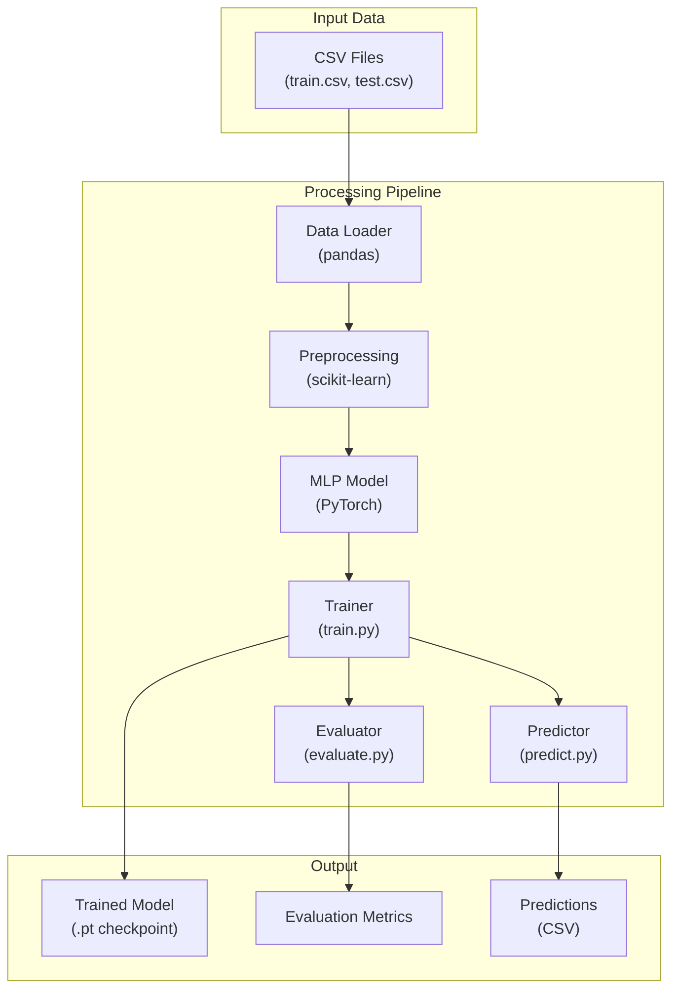

<div align="center">

# MLP Binary Classification (Titanic)

Multi-Layer Perceptron implementation (MLP) for binary classification on the Titanic dataset.

[](https://pytorch.org/)
[](https://numpy.org/)
[](https://pandas.pydata.org/)
[](https://scikit-learn.org/)
[](https://www.python.org/)
[](LICENSE)
[](https://www.kaggle.com/c/titanic)

</div>

## Overview

MLP Binary Classification (Titanic) is a machine learning project that implements a Multi-Layer Perceptron neural network for binary classification on the Kaggle Titanic dataset. The project provides a complete pipeline from raw CSV data to trained model with evaluation metrics and predictions.

Technology Stack:

- **PyTorch** — Deep learning framework for neural network implementation, tensor computation, and optimization
- **NumPy** — Fundamental package for numerical computing with powerful N-dimensional arrays
- **pandas** — Fast, powerful data analysis and manipulation tool for DataFrame operations
- **scikit-learn** — Machine learning library for preprocessing, model evaluation, and metrics
- **Python 3.14+** — Primary programming language and runtime

### Dataset

- **Titanic Dataset** — Original Kaggle competition dataset ([Kaggle](https://www.kaggle.com/c/titanic) | [GitHub mirror](https://github.com/ashishpatel26/Titanic-Machine-Learning-from-Disaster))

### Architecture



## Usage

1. Clone the repository:

    ```bash
    git clone https://github.com/Mournweiss/mlp-binary-classification.git
    cd mlp-binary-classification
    ```

2. Run the pipeline:

    ```bash
    chmod +x build.sh
    ./build.sh
    ```

    Or pixi tasks:

    ```bash
    # Full pipeline (train + evaluate + predict)
    pixi run train

    # Train and evaluate only
    pixi run train-eval

    # Train and predict only
    pixi run train-predict

    # Run tests
    pixi run test

    # Run linting
    pixi run lint

    # Run formatting
    pixi run format

    # Run type checking
    pixi run typecheck
    ```

### Pixi Environments

| Environment | Description                      |
| ----------- | -------------------------------- |
| `default`   | Base dependencies + CUDA PyTorch |
| `dev`       | Base + dev tools + CUDA PyTorch  |
| `cpu`       | Base dependencies + CPU PyTorch  |

## Environment Variables

### Project Configuration

- **`LOG_LEVEL`**: Logging level (Default: `INFO`)
- **`PROGRESS_BAR`**: Enable tqdm progress bar during training (Default: `true`)
- **`PRINT_FREQ`**: Print metrics every N epochs (Default: `5`)
- **`PYTHONPATH`**: Python module search path (Default: `src`)

### Data Configuration

- **`TRAIN_DATA_PATH`**: Path to the training dataset CSV (Default: `data/train.csv`)
- **`TEST_DATA_PATH`**: Path to the test dataset CSV (Default: `data/test.csv`)
- **`VAL_SPLIT`**: Validation split ratio (fraction of training data) (Default: `0.2`)
- **`RANDOM_SEED`**: Random seed for reproducibility (Default: `42`)
- **`DOWNLOAD_DATASET`**: Enable automatic dataset download (Default: `true`)
- **`DATASET_URL`**: Base URL for downloading Titanic dataset files (Default: `https://raw.githubusercontent.com/ashishpatel26/Titanic-Machine-Learning-from-Disaster/master/input`)

### Model Configuration

- **`MODEL_SEED`**: Random seed for model initialization (Default: `42`)
- **`INPUT_SIZE`**: Input feature dimension (Default: `9`)
- **`HIDDEN_SIZES`**: Comma-separated hidden layer sizes (Default: `64,32,16`)
- **`DROPOUT`**: Dropout probability, range 0.0 to 1.0 (Default: `0.3`)
- **`LEARNING_RATE`**: Learning rate for the optimizer (Default: `0.001`)
- **`WEIGHT_DECAY`**: Weight decay for L2 regularization (Default: `0.0001`)
- **`EPOCHS`**: Number of training epochs (Default: `50`)
- **`BATCH_SIZE`**: Batch size for training (Default: `32`)
- **`GRADIENT_CLIP`**: Gradient clipping threshold (Default: `1.0`)

### Device Configuration

- **`DEVICE`**: Force compute device — `cpu`, `cuda`, `mps`, or `auto` (Default: `auto`)
- **`CUDA_DEVICE`**: CUDA device ID when using GPU (Default: `0`)
- **`CUDA_PROFILE`**: Enable CUDA memory profiling (Default: `false`)
- **`PYTORCH_CUDA_ALLOC_CONF`**: CUDA memory allocator configuration (Default: `backend:native,expandable_segments:False`)

### PyTorch Configuration

- **`DISTRIBUTED`**: Enable distributed training (Default: `false`)
- **`WORLD_SIZE`**: Total number of GPU processes (Default: `1`)
- **`RANK`**: Rank of current process for multi-GPU (Default: `0`)
- **`MASTER_ADDR`**: Master address for distributed training (Default: `localhost`)
- **`MASTER_PORT`**: Master port for distributed training (Default: `29500`)
- **`CUDNN_BENCHMARK`**: Enable cuDNN benchmark mode (Default: `false`)
- **`CUDNN_DETERMINISTIC`**: Enable cuDNN deterministic mode (Default: `false`)
- **`NUM_WORKERS`**: Data loader workers (0 = main process) (Default: `0`)
- **`PIN_MEMORY`**: Pin memory for CPU-to-GPU transfer (Default: `true`)

### Output Configuration

- **`CHECKPOINT_DIR`**: Directory for model checkpoints (Default: `checkpoints`)
- **`MODEL_PATH`**: Path to save the final model (Default: `model.pt`)
- **`SUBMISSION_PATH`**: Path for the Kaggle submission CSV (Default: `submission.csv`)

## License

This project is licensed under the [Apache License 2.0](LICENSE).

### Component Licenses

| Component           | License                                                    | Source                                                                                                                         |
| ------------------- | ---------------------------------------------------------- | ------------------------------------------------------------------------------------------------------------------------------ |
| **PyTorch**         | BSD-3-Clause                                               | [github.com/pytorch/pytorch](https://github.com/pytorch/pytorch)                                                               |
| **NumPy**           | BSD-3-Clause                                               | [numpy.org](https://numpy.org/)                                                                                                |
| **pandas**          | BSD-3-Clause                                               | [github.com/pandas-dev/pandas](https://github.com/pandas-dev/pandas)                                                           |
| **scikit-learn**    | BSD-3-Clause                                               | [scikit-learn.org](https://scikit-learn.org/)                                                                                  |
| **Python**          | PSF-2.0                                                    | [python.org](https://www.python.org/)                                                                                          |
| **Ruff**            | MIT                                                        | [github.com/astral-sh/ruff](https://github.com/astral-sh/ruff)                                                                 |
| **mypy**            | MIT                                                        | [github.com/python/mypy](https://github.com/python/mypy)                                                                       |
| **pytest**          | MIT                                                        | [github.com/pytest-dev/pytest](https://github.com/pytest-dev/pytest)                                                           |
| **Black**           | MIT                                                        | [github.com/psf/black](https://github.com/psf/black)                                                                           |
| **Titanic Dataset** | [ODC-by 1.0](https://opendatacommons.org/licenses/by/1-0/) | [Kaggle](https://www.kaggle.com/c/titanic) · [GitHub](https://github.com/ashishpatel26/Titanic-Machine-Learning-from-Disaster) |
